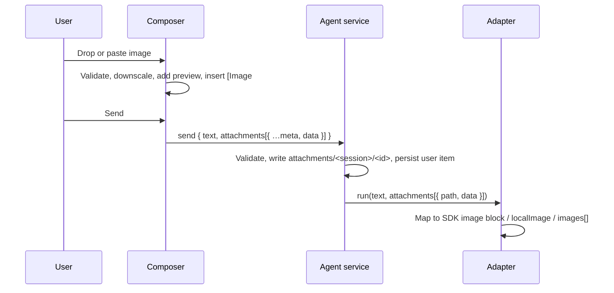

# Chat image attachments: research

Status: implemented on 2026-09-13; section 9 records the delivered scope. Research date: 2026-09-13. Source inspection of the current checkout, the installed harnesses (Claude Code 2.1.270 with Agent SDK 0.3.270, Codex 0.154.0, Pi 0.85.1), their generated protocol schemas, and the vendor documentation and source listed in section 8. No implementation changes and no tests were run.

Goal: let a user drop or paste an image into the Chat composer, see a preview above the input, reference the image from inside the message text, and have the image reach whichever harness the session uses.

## 1. Answer in short

**Yes, every harness Cerebro integrates accepts user images natively, and it is meaningful for all three.** Each one has a first-class image slot on the exact call the adapters already make, and the models each harness discovers are overwhelmingly vision-capable.

| Harness                 | Where the image goes today                                                                          | Reference convention the harness already uses                                                          | Model gate available                                                           |
| ----------------------- | --------------------------------------------------------------------------------------------------- | ------------------------------------------------------------------------------------------------------ | ------------------------------------------------------------------------------ |
| Claude Code (Agent SDK) | `SDKUserMessage.message.content` as an Anthropic `image` block (base64); streaming input mode only  | `[Image #N]` chip inserted into the prompt text by the Claude Code CLI                                 | Not exposed by `supportedModels()`; all current Claude models accept images    |
| Codex (app-server)      | `turn/start` `input[]` item `{type:'localImage', path}` or `{type:'image', url}` with a `data:` URL | `[Image #N]` used by the Codex TUI, recorded as a `text_elements` placeholder span                     | `model/list` returns `inputModalities` per model; missing means text and image |
| Pi (RPC)                | `prompt` / `steer` / `follow_up` `images: [{type:'image', data, mimeType}]`                         | Pi's TUI pastes a temp file path into the text and lets the `read` tool load it; RPC attaches directly | `get_available_models` returns `input: ['text','image']` per model             |

Two of the three harnesses already teach their models the `[Image #N]` marker. Reusing it as Cerebro's cross-harness reference marker costs nothing and matches what the models have seen in training data and native sessions. Pi receives the same text; the marker is plain text to it, and the numbered order matches the order of its `images` array.

Recommendation: implement one normalized attachment path (renderer reads bytes, host stores them, adapter maps them), keep `[Image #N]` as the in-text marker, gate the composer per selected model where the harness reports modalities, and flip `imageInput` to `true` for all three adapters once wired.

## 2. Evidence per harness

### 2.1 Claude Code through the Agent SDK

- `packages/mux/src/agents/adapters.ts` calls `query({ prompt: context.text, … })` with a plain string. The SDK also accepts `AsyncIterable<SDKUserMessage>`; the same adapter's `models()` already builds one for `supportedModels()`.
- The installed SDK's `SDKUserMessage.message` is an Anthropic `MessageParam`, documented in its type comment as "a string or an array of content blocks (text, image, document, tool_result, ...)". An image block is `{ type: 'image', source: { type: 'base64', media_type, data } }`.
- The Claude Code binary contains the `[Image #${n}]` template and a literal `[Image #N]`, confirming the CLI's convention for pasted images.
- The SDK documentation states that single-message (string prompt) mode does not support direct image attachments, and lists image uploads as a benefit of streaming input mode. The `resume` option sits in the shared options table used by both prompt forms; no page restricts the combination. Claude Code persists the user message, including the base64 image block, in its own session JSONL, so the native resume binding keeps the image in context without Cerebro re-sending it.
- The Claude Code terminal CLI also writes pasted images to `~/.claude/image-cache/<session-id>/N.png` and injects a companion `[Image: source: …]` user message. That is CLI behavior, not SDK behavior; Cerebro does not need to imitate it.
- API limits: `image/jpeg`, `image/png`, `image/gif`, `image/webp`; 10 MB base64 per image on the Claude API (5 MB on Bedrock and Vertex); 100 images per request on 200k-context models; 8000 × 8000 px maximum; 32 MB per request. Claude Code's own Read tool resizes large images and re-encodes anything still over 500 KB as JPEG, which is a reasonable precedent for a renderer-side downscale.
- `supportedModels()` returns `ModelInfo { value, resolvedModel?, displayName, … }` and no modality flags. Cerebro should treat Claude models as image-capable and rely on the API error path for anything exotic.

### 2.2 Codex through the app-server

Generated with `codex app-server generate-ts` from the installed binary:

```ts
export type UserInput =
  | { type: 'text'; text: string; text_elements: Array<TextElement> }
  | { type: 'image'; detail?: ImageDetail; url: string }
  | { type: 'localImage'; detail?: ImageDetail; path: string }
  | { type: 'audio'; url: string }
  | { type: 'localAudio'; path: string }
  | { type: 'skill'; name: string; path: string }
  | { type: 'mention'; name: string; path: string }
export type ImageDetail = 'auto' | 'low' | 'high' | 'original'
export type TextElement = { byteRange: ByteRange; placeholder: string | null }
export type Model = { …, inputModalities: Array<InputModality>, … }
export type InputModality = 'text' | 'image' | 'audio'
```

- The adapter already sends `input: [{ type: 'text', text }]` to `turn/start`; adding `localImage` items beside it is the whole wire change. `localImage` takes an absolute path that the app-server reads, resizes to fit unless `detail: 'original'`, and converts to a `data:` URL before the request. On the wire to the model each local image becomes `<image name=[Image #N] path="/abs/path">`, the `input_image`, and a closing tag, so Codex itself ties the file to the `[Image #N]` name. `image` is documented as a pre-encoded `data:` URI and is the fallback if a path is ever unavailable.
- The Codex TUI renders attached images as `[Image #N]` placeholders in the composer text and records each one as a `text_elements` span whose `placeholder` is that literal; the installed binary contains the same strings.
- `text_elements` marks UI-owned spans inside `text` (byte ranges into the UTF-8 buffer plus an optional placeholder) so history and resume keep rich markers without mutating the literal text. Cerebro can send an empty array today and later emit one span per `[Image #N]` marker so Codex's own history views show them as chips.
- The adapter's `model/list` loop already reads `displayName`, `hidden`, and `supportedReasoningEfforts`; `inputModalities` is on the same object and just needs to be carried into the catalog. A missing field means text and image.
- Codex core never rejects an image for a text-only model. It strips unsupported image content from the history before every sampling request. The TUI blocks client-side instead, restoring the draft with "Model … does not support image inputs. Remove images or switch models." Cerebro should copy the TUI's client-side gate so the user is not left guessing why the model ignored the picture.

### 2.3 Pi through RPC mode

From `docs/rpc.md` in the installed package and `dist/modes/rpc/rpc-mode.js`:

```json
{
  "type": "prompt",
  "message": "What's in this image?",
  "images": [{ "type": "image", "data": "<base64>", "mimeType": "image/png" }]
}
```

- `prompt`, `steer`, and `follow_up` all take the optional `images` array; the RPC handler passes it straight to `session.prompt(message, { images })`, which appends the image blocks after the text block in the user message.
- `get_available_models` rows carry `input: ["text", "image"]`.
- Pi's own TUI does not attach pasted images inline. It writes the clipboard image to `os.tmpdir()/pi-clipboard-<uuid>.<ext>`, inserts that path into the editor, and submits plain text; the model then fetches the file with the `read` tool. Only `@file` command-line arguments are preloaded as `images`. A third-party extension, `pi-image-paste`, adds a `[#image 1]` placeholder precisely because core has none.
- Pi never errors on an image for a text-only model. Its message transform replaces user image blocks with the text "(image omitted: model does not support images)" when `model.input` lacks `image`, and the `read` tool substitutes "[Current model does not support images. The image will be omitted from this request.]". Cerebro should gate on the model's `input` list client-side rather than let the omission happen silently.
- Pi stores the user message content, images included, in its session file, so native resume keeps them.

## 3. What exists in Cerebro today

- `AgentCapabilities.imageInput` already exists in `packages/core/src/chat.ts` and is `false` for all three adapters in `packages/mux/src/agents/service.ts`.
- `ChatCommand` for `send` carries only `text`. `ChatItem` for `user` carries only `text`, rendered by `chat-user-message.tsx`.
- The composer in `chat-view.tsx` is a plain textarea; the draft is a string in `localStorage`. There is no drop, paste, or file handling, and the preload does not expose `webUtils.getPathForFile`.
- Transport budget: Electron IPC has no practical limit for a few megabytes; the mux socket protocol (`packages/mux/src/protocol.ts`) splits messages into 64 KB frames up to 32 MB per message. The agent service rejects `text` over 100,000 characters, so attachments must travel in their own field, not inside `text`.
- Persistence: sessions are JSON snapshots under `CEREBRO_HOME/mux/agents/`, with a roughly 2 MB display projection limit. Image bytes cannot live in the session JSON.
- The plan in `agent-chat-plan.md` already reserved the shape: "Inputs should support ordered text and attachment references. Images/files have explicit MIME types and host-owned references" and "Artifact storage/retrieval belongs to the host, with large binaries kept outside ordinary transcript events."

## 4. Proposed design

### 4.1 Contract

```ts
export type ChatAttachment = {
  id: string // client-generated UUID, stable across retries of the same command
  kind: 'image'
  name: string // original file name or "Pasted image"
  mimeType: 'image/png' | 'image/jpeg' | 'image/gif' | 'image/webp'
  bytes: number
  width?: number
  height?: number
}
// ChatCommand (send): attachments?: Array<ChatAttachment & { data: string /* base64 */ }>
// ChatItem (user):    attachments?: ChatAttachment[]   // metadata only
// AgentModel:         inputModalities?: Array<'text' | 'image'>
```

- The marker in `text` is `[Image #N]`, numbered 1-based in attachment order. Only the renderer creates it, on drop or paste, and it is atomic: it cannot be edited in place, only removed and re-added (see 4.3). Sending with an attachment that has no marker is allowed; the harness still receives the image, exactly as the native CLIs behave.
- Adapters receive `context.attachments` as `{ id, mimeType, path, data }` where `path` is the host-owned file and `data` is base64 loaded on demand.

### 4.2 Renderer

- Drop target is the whole composer form, with a visible "Drop image to attach" overlay while dragging. Accept `image/png`, `image/jpeg`, `image/gif`, `image/webp`; reject others with an inline error, never a disabled submit control.
- Handle both `drop` and `paste` from `DataTransfer.files` and `clipboardData.items`. Read bytes with `File.arrayBuffer()`; no file path is needed, which sidesteps the Electron 39 removal of `File.path` and avoids adding `webUtils` to the preload.
- Preview strip above the textarea: thumbnail, `#N` badge, file name, size, and a remove control. Clicking a thumbnail opens a larger preview.
- Downscale in the renderer with a canvas when the long edge exceeds 2000 px, then cap the encoded size at 5 MB. That stays under the Claude API's 10 MB per-image limit with room for base64 growth, matches the stricter Bedrock and Vertex ceiling in case a user's Claude configuration routes there, and is well under what Codex and Pi providers accept. Keep the original MIME type except GIF, which becomes PNG when resized.
- Draft attachments live in component state, not `localStorage`. A reload drops both the attachments and their markers, since a marker without its attachment is meaningless under the atomic rule in 4.3. Persisting drafts with images can use IndexedDB later if needed.
- Transcript: `ChatUserMessage` renders the thumbnails for `item.attachments` and turns each `[Image #N]` in the text into a chip that scrolls to or highlights its thumbnail. Bytes come from a new `window.cerebro.chatAttachment({ sessionId, id })` call that returns a `data:` URL, so session snapshots stay small.

### 4.3 Atomic marker chips in the composer

Requirement: a `[Image #N]` marker in the input is one unit. The user cannot edit its text or type one by hand. The only way to change it is to remove it and attach the image again. This matches Claude Code, where the chip is inserted by paste and deleted as a whole, and the Codex TUI, where placeholders are non-editable rows tracked as `text_elements` spans.

Recommended mechanism: keep the plain `<textarea>` and make the composer state `{ text, chips: [{ attachmentId, start, end }] }`, the same model Codex uses for `text_elements`. The text stays the single source of truth for what is sent; the chip list says which spans are markers.

| Rule                        | Behavior                                                                                                                                                                                                                                                                                         |
| --------------------------- | ------------------------------------------------------------------------------------------------------------------------------------------------------------------------------------------------------------------------------------------------------------------------------------------------ |
| Creation                    | Only drop, paste, or the attach button insert a marker, at the caret, with one surrounding space where needed. Typing `[Image #2]` by hand produces plain text that is never tracked, so it is sent as ordinary text and is not a chip.                                                          |
| Caret movement              | Left and right arrows, Home, End, and mouse clicks snap the caret to the nearest chip boundary; the caret never rests inside a chip.                                                                                                                                                             |
| Backspace and Delete        | With the caret at a chip boundary, the key removes the whole chip. With a selection that overlaps a chip, the whole chip is included in the removal.                                                                                                                                             |
| Typing or paste over a chip | Any `input` event whose changed range overlaps a chip removes that chip entirely and applies the rest of the edit. The reconciler compares the previous and next text around each tracked span; if the span's text no longer equals its marker, the span is dropped and its text is spliced out. |
| Removing a chip             | Removing the marker removes the attachment, and removing the attachment from the preview strip removes the marker. Remaining chips renumber to `#1…#K` in attachment order, in both the text and the strip.                                                                                      |
| Undo                        | Browser undo inside the textarea is allowed for plain text. An undo that re-inserts a removed marker's text yields plain text, the same as typing it by hand, because the attachment is gone and only tracked spans are chips.                                                                   |
| Composition (IME)           | While `isComposing` is true, chip rules are suspended; the reconciler runs on `compositionend`.                                                                                                                                                                                                  |
| Draft persistence           | Only text without markers is written to `localStorage`. Chips and attachments are not persisted, so a reload never shows an orphan marker.                                                                                                                                                       |

Why not a `contenteditable` editor: a `contenteditable="false"` inline chip gives styled, natively atomic chips, but it costs a DOM-to-text serializer, custom paste and Enter handling, IME edge cases, and either a hand-rolled editor or a dependency such as Lexical. The textarea approach keeps the existing draft model, tests, and Enter-to-send behavior, and the preview strip already gives the visual identity. If styled inline chips are wanted later, the tracked-span state converts directly into chip nodes, so the upgrade does not change the contract.

Test cases for `chat.spec.ts`: paste inserts a chip and a thumbnail; arrow keys skip over the chip; Backspace at the chip boundary removes chip and thumbnail together; selecting half the chip and typing removes the chip; typing `[Image #1]` by hand does not create a thumbnail; removing thumbnail #1 renumbers `[Image #2]` to `[Image #1]` in the text; reload keeps the text but drops chips and thumbnails.

### 4.4 Host and adapters

- Service: on `send`, validate each attachment (MIME allowlist, per-image and per-message size ceilings, count ceiling), write bytes to `CEREBRO_HOME/mux/agents/attachments/<sessionId>/<id>.<ext>` with mode 0600, and store only metadata on the user item. Persist before dispatch like the text, so an uncertain turn still shows what was sent. Delete the folder when a session is deleted.
- Claude adapter: switch `prompt` to a one-message `AsyncIterable<SDKUserMessage>` whose content is `[{ type: 'text', text }, …imageBlocks]`. Keep the string path when there are no attachments to leave existing fixtures untouched.
- Codex adapter: append `{ type: 'localImage', path }` per attachment after the text item; add `text_elements: []` to the text item to match the schema.
- Pi adapter: pass `images: [{ type: 'image', data, mimeType }]` on `prompt`.
- Catalog: carry `inputModalities` from Codex `model/list` and Pi `get_available_models`; set `['text','image']` for Claude. Set `imageInput: true` in all three capability records once each adapter is wired.
- Composer gate: when the selected model reports modalities without `image`, show an inline error on drop and on send. Both Codex and Pi would otherwise strip the image silently and the model would answer as if it were never sent.

### 4.5 Sequence



## 5. Limits and edge cases to honor

| Concern               | Guidance                                                                                                                                                                      |
| --------------------- | ----------------------------------------------------------------------------------------------------------------------------------------------------------------------------- |
| Per-image size        | Cap at 5 MB after downscale. The Claude API allows 10 MB base64 per image, Bedrock and Vertex allow 5 MB, and the request as a whole is capped at 32 MB.                      |
| Per-message count     | Cap at 20 in the first version; the composer shows a clear error beyond it.                                                                                                   |
| Text-only models      | Codex and Pi expose modalities and would strip the image silently; block send with an error, as the Codex TUI does. Claude has no flag; rely on the API error and surface it. |
| Retries               | The attachment `id` and the command ID stay stable across a retried send, so the host does not write duplicates.                                                              |
| Native resume         | All three harnesses persist the image in their own history; Cerebro never re-sends attachments on the next turn.                                                              |
| Host restart          | Attachment files survive; the metadata on the user item is enough to render thumbnails again.                                                                                 |
| Multi-root workspaces | Attachment storage is per session, not per repository, so cwd changes do not move files.                                                                                      |
| Privacy               | Attachments are user-supplied and stored under the private data directory with 0600 permissions; nothing is copied into native config directories.                            |

## 6. Verification when implementing

- Adapter fixture tests: one recorded frame per harness proving the image item, block, or array appears beside the text, plus the Claude string-prompt path staying unchanged without attachments.
- Service tests: validation errors, file layout, metadata-only persistence, cleanup on delete.
- Electron Playwright in `chat.spec.ts`: drop and paste via `page.dispatchEvent` with a `DataTransfer`, preview and marker insertion, the atomic chip cases in 4.3, removal with renumbering, send with the deterministic fixture, thumbnail rendering in the transcript, and the text-only model error. Capture screenshots per AGENTS.md.
- Run lint, Prettier, and React Doctor on changed files only.

## 7. Open questions

1. Should the marker be `[Image #N]` everywhere, or should Pi receive the native path form its TUI uses? Recommendation: `[Image #N]` for all, since Pi's RPC path attaches the bytes directly and the path form would only matter for the `read` tool.
2. Should attachment storage be shared with future agent-produced artifacts? Recommendation: yes, use the same folder layout and retrieval IPC so the artifact viewer in the plan's deferred work reuses it.
3. Should drafts with images survive reload? Defer; markers are dropped with their attachments on reload, and re-attaching is cheap.

## 8. Sources

- Claude Code interactive mode, `[Image #N]` chip and paste shortcut: https://code.claude.com/docs/en/interactive-mode
- Claude Code image workflows (drag, paste, path): https://code.claude.com/docs/en/common-workflows#work-with-images
- Agent SDK streaming versus single-message input, image attachments: https://code.claude.com/docs/en/agent-sdk/streaming-vs-single-mode
- Agent SDK TypeScript reference, `query` prompt forms and `resume`: https://code.claude.com/docs/en/agent-sdk/typescript
- Claude API vision limits: https://platform.claude.com/docs/en/build-with-claude/vision#image-limits-and-costs
- Claude Code Read tool image handling: https://code.claude.com/docs/en/tools-reference
- Claude Code image cache and companion message (issue report): https://github.com/anthropics/claude-code/issues/93429
- Codex TUI composer placeholders: https://github.com/openai/codex/blob/main/codex-rs/tui/src/bottom_pane/chat_composer.rs
- Codex `UserInput`, `TextElement`, `LocalImage` conversion: `codex-rs/protocol/src/user_input.rs`, `codex-rs/protocol/src/local_media.rs`, `codex-rs/protocol/src/models.rs` in https://github.com/openai/codex
- Codex app-server protocol and modality defaults: https://learn.chatgpt.com/docs/app-server
- Codex image-stripping for unsupported models: `codex-rs/core/src/context_manager/history.rs` and the TUI gate in `codex-rs/tui/src/chatwidget/settings.rs`
- Pi RPC protocol: https://github.com/earendil-works/pi/blob/main/packages/coding-agent/docs/rpc.md
- Pi interactive paste handling: https://github.com/earendil-works/pi/blob/main/packages/coding-agent/src/modes/interactive/interactive-mode.ts
- Pi image downgrade for text-only models: `packages/ai/src/api/transform-messages.ts` in the same repository
- Pi image paste extension with placeholders: https://pi.dev/packages/pi-image-paste
- Local: `codex app-server generate-ts` output from Codex 0.154.0; `docs/rpc.md` and `dist/` of the installed Pi 0.85.1 package; `sdk.d.ts` of the installed Agent SDK 0.3.270

## 9. Delivered implementation

- Contract: `ChatAttachment`, `ChatAttachmentUpload`, `chatAttachmentLimits`, `chatImageMarker`, and `AgentModel.modalities` in `packages/core/src/chat.ts`. `ChatCommand.send` carries `attachments`; user items carry metadata only.
- Host: `packages/mux/src/agents/service.ts` validates MIME type, magic bytes, per-image, per-message, and count limits, writes files with mode 0600 under `attachments/<session>/`, and exposes `attachment()` for the `chat.attachment` mux method, which is scoped by workspace.
- Adapters: `packages/mux/src/agents/adapters.ts` sends a Claude image block through streaming input, Codex `localImage` items with `text_elements` spans for each marker, and Pi `images`. Model discovery records modalities from Codex `inputModalities` and Pi `input`; Claude is text and image.
- Renderer: `chat-attachments.ts` holds the chip model (insert, remove, reconcile, snap, strip) and image preparation; `use-composer-draft.ts` binds it to the textarea; `chat-composer-attachments.tsx` renders the strip and drop overlay; `chat-user-message.tsx` renders thumbnails, chips, and a preview dialog backed by the retrieval call.
- Composer state lives in the renderer only. Drafts persist text without chips, so a reload drops attachments and their markers together.
- The transcript matches `[Image #N]` by text against the message's attachments, since sent messages carry text and attachment metadata rather than chip spans. A hand-typed look-alike that names an existing attachment therefore also renders as a chip there; the atomic rule applies to the composer.
- Live verification on 2026-09-13 through the real adapters with a screenshot attached: Claude Code (Haiku and Sonnet), Codex (gpt-5.5), and Pi via its `openai-codex` provider (gpt-5.5) each described the image and quoted the composer text. Pi's catalog also lists models the ChatGPT account cannot use, such as gpt-5.4-mini; those fail with the provider's own error, not an image error.
- Host upgrades: a running mux daemon from an older build ignored attachments because clients kept whatever same-protocol host was already running. `connectMux` now replaces a host whose staged build is older than the client's (see [mux-runtime.md](mux-runtime.md)).
- Verification: adapter fixture tests for all three protocols, service storage and validation tests, and an Electron Playwright case in `chat.spec.ts` covering drop, paste, the file picker, caret snapping, chip destruction by Backspace and by typing over a selection, hand-typed look-alikes, renumbering, reload, send, transcript thumbnails and preview, and the text-only model refusal.
