# Cerebro agent chat: high-level plan

Status: implementation authorized by the user on 2026-09-13. The first local implementation is implemented and locally verified, with the Claude live-auth limitation below; section 16 records its concrete scope and remaining work.

This plan consolidates the conversation's decisions. It supersedes the earlier research document's suggestion to adopt assistant-ui. The [source research](multi-agent-chat-research.md) remains supporting evidence, not an implementation specification.

## 1. Outcome and scope

Users can work with their Claude Code, Codex, and Pi agents through Cerebro's own graphical chat interface. One normalized adapter contract connects all three agents to the same UI. Each native agent keeps responsibility for its agent loop, tools, context management, and native conversation state.

Chat is a first-class tab kind alongside Terminal and Changes. It is also a pane kind so it fits the existing mixed BSP layout. A new Chat tab begins with one chat pane, and a mixed tab can show Chat beside Terminal or Changes.

The first implementation covers local execution of these three agents. The design leaves room for more adapters and remote clients without making either a prerequisite.

## 2. Decision record

| Decision                                                                                 | Status                                    | Consequence                                                                                                                          |
| ---------------------------------------------------------------------------------------- | ----------------------------------------- | ------------------------------------------------------------------------------------------------------------------------------------ |
| Build Cerebro's own React chat UI                                                        | Agreed                                    | No assistant-ui or AI Elements runtime dependency; focused rendering libraries remain possible                                       |
| Searchable model dropdown in the chat input, with provider/harness filters and favorites | Agreed eventual UI requirement            | One picker exposes valid model/harness combinations and persistent favorite choices; catalog design must support this from the start |
| Normalize native agents behind a shared contract                                         | Agreed                                    | The UI does not understand provider wire protocols                                                                                   |
| Initial agents: Claude Code, Codex, Pi RPC                                               | Agreed                                    | All three must work through the same interface                                                                                       |
| Claude Agent SDK, Codex app-server, Pi RPC                                               | Planned integration choices from research | Verify exact supported versions and behavior before implementation                                                                   |
| Support existing native Claude login/subscription                                        | Agreed product intent                     | Native Claude runtime owns credentials and refresh; no API-only requirement                                                          |
| Chat is both a tab kind and pane kind                                                    | Agreed                                    | Reuse the existing tab bar and BSP machinery                                                                                         |
| Session lifetime is independent of mounted UI                                            | Agreed                                    | Tab switches and Electron reload do not stop running agents                                                                          |
| Preserve provider differences through capabilities and metadata                          | Agreed                                    | Shared UI does not claim identical feature support                                                                                   |
| Separate normalization from transport                                                    | Agreed                                    | WebSocket is a possible carrier, not the adapter contract                                                                            |
| Reuse local IPC/socket transport first                                                   | Proposed default                          | Avoid a WebSocket migration for local chat                                                                                           |
| Keep session service beside terminal service in the standalone host                      | Proposed placement                        | Separate responsibilities; exact package/process arrangement remains open                                                            |
| Closing a Chat tab only closes its view                                                  | Implemented                               | Active work continues; Stop interrupts a turn; the Chat history selector reopens saved sessions                                      |

## 3. Architecture and ownership

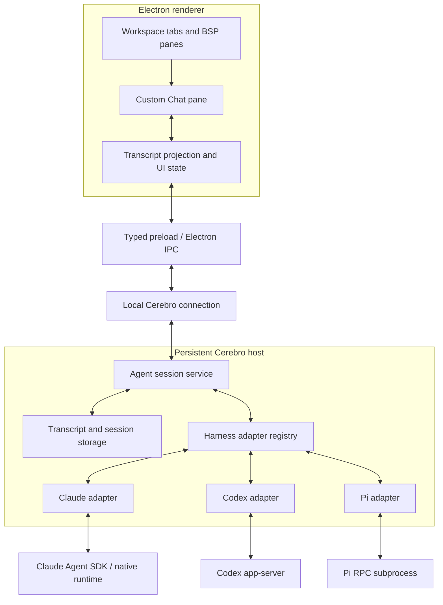

| Boundary        | Responsibility                                                                                      |
| --------------- | --------------------------------------------------------------------------------------------------- |
| Native runtime  | Agent reasoning/loop, native tools, context, authentication, native history                         |
| Adapter         | Process/protocol interaction, capability discovery, native-to-common mapping, native resume handles |
| Session service | Logical session identity, command ordering, lifecycle, subscriptions, persistence and recovery      |
| UI projection   | Convert ordered normalized state into transcript rows; preserve stable identities                   |
| Chat components | Render content and collect user actions                                                             |
| Transport       | Deliver typed commands, replies and events without defining agent semantics                         |

Cerebro already has a standalone mux and shared layout types. Extend those boundaries rather than creating renderer-owned agent processes. Agent sessions must not become PTY screen buffers: chat is structured data, while terminal output remains terminal data.

## 4. Domain model

Keep these identities separate even if the initial UI presents a simple agent/model selector:

| Entity             | Meaning                                                                 |
| ------------------ | ----------------------------------------------------------------------- |
| Harness            | Claude Code, Codex, or Pi: the agent implementation                     |
| Model provider     | Backend service selected through that harness                           |
| Model              | Opaque model identifier within the selected configuration               |
| Instance           | Harness configuration, executable/version, native account profile, host |
| Session            | Cerebro-owned logical conversation with a native resume binding         |
| Runtime generation | A particular live process/session incarnation; changes after restart    |
| Turn               | One accepted user request and the agent work it causes                  |
| Item               | A stable transcript unit such as a message, tool, plan, or artifact     |
| Request            | A pending permission or question requiring a correlated response        |
| Attachment         | A client/view subscription to session state; does not own the process   |

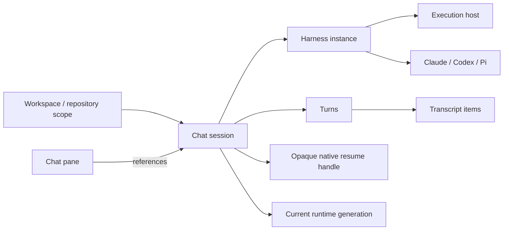

Initial recommendation: one session per new chat pane. Session identity is not the pane ID, leaving room for reopening an existing conversation later. Exact session-history navigation is an open UX decision.

## 5. Adapter contract

Separate instance-level operations from session-level operations.

| Instance operations                    | Session operations                  |
| -------------------------------------- | ----------------------------------- |
| Detect executable and version          | Create or resume                    |
| Report readiness/authentication status | Send a turn                         |
| Discover models and options            | Cancel an active turn               |
| Report capabilities                    | Reply to a permission request       |
| Resolve configuration                  | Answer a structured question        |
| Provide useful setup errors            | Observe normalized events           |
|                                        | Describe native persistence binding |
|                                        | Stop/release the runtime explicitly |

Optional operations include steering, compaction, changing a model in session, fork, and rewind. The adapter reports whether they are supported and when an option change takes effect. A method being present in a UI must correspond to an actual supported native action.

Use one shared command/event contract; do not add unrelated UI-specific convenience methods to each provider adapter. An adapter may use internal protocol helpers without exposing them to consumers.

### Native integration choices

| Agent       | Planned mechanism                                              | Details to verify                                                                                                    |
| ----------- | -------------------------------------------------------------- | -------------------------------------------------------------------------------------------------------------------- |
| Claude Code | TypeScript Agent SDK targeting the installed native executable | Native login inheritance, settings/skills loading, partial events, tool permissions, questions, native resume        |
| Codex       | app-server with local stdio                                    | Handshake/schema version, thread/turn lifecycle, requests versus notifications, model discovery, native resume       |
| Pi          | Native RPC mode                                                | Prompt/event mapping, model discovery and selection, cancellation, native sessions, supported extension interactions |

Direct Claude streaming JSON is a researched alternative, not a second implementation required in the first release. ACP remains a possible future adapter for additional agents; it is not required for these three.

## 6. Normalized input and output

Inputs should support ordered text and attachment references. Images/files have explicit MIME types and host-owned references. File paths in user text are not automatically access grants.

The event model must distinguish incremental changes from authoritative replacements and terminal outcomes.

| Family                 | Examples                                         | UI treatment                |
| ---------------------- | ------------------------------------------------ | --------------------------- |
| Session/turn lifecycle | Started, waiting, completed, interrupted, failed | Status and controls         |
| Message content        | Text delta, reasoning delta, completed content   | Markdown/text rows          |
| Tool lifecycle         | Started, input update, output update, result     | Tool/command cards          |
| File activity          | Structured edit or diff reference                | Diff renderer               |
| Plan                   | Steps and status updates                         | Plan component              |
| Permission             | Request, native option IDs, resolution           | Approval controls           |
| Question               | Fields/options, answer, resolution               | Structured answer component |
| Artifact               | Image/file metadata and retrieval reference      | Preview or fallback         |
| Usage/configuration    | Reported usage, active model/options             | Session details             |

Every event has session identity, sequence and schema version. Include turn, item, runtime-generation and request identities where applicable. Preserve native identities and bounded metadata so normalization does not discard useful detail.

Rules:

- Tool calls update by ID; a final aggregate replaces its streaming value without duplicate output.
- Unknown exit status remains unknown, not success. Native tool completion and command success are distinct.
- Reasoning displays only content the agent exposes; absence is not synthesized.
- Unknown tool/content types retain a readable generic fallback.
- Error categories distinguish missing executable, login required, unsupported capability, process failure, protocol mismatch, and uncertain dispatch outcome.
- Native tool events describe work already performed. Rendering them must never execute that work a second time.

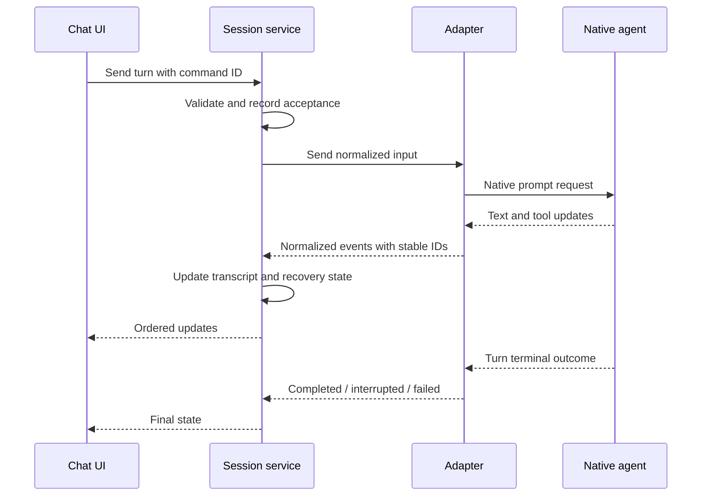

## 7. Custom chat UI

Cerebro owns the transcript, composer, interaction controls, scrolling, and presentation. Small libraries for Markdown, syntax highlighting, diagrams, or diffs can be selected later. Reuse existing Changes rendering where appropriate instead of building a second incompatible diff stack.

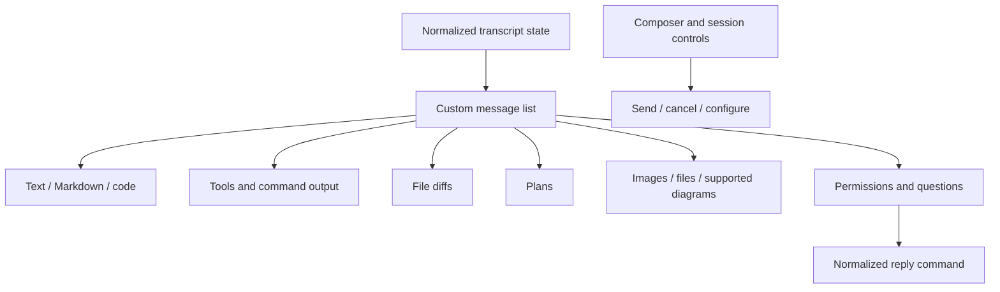

The renderer applies live and restored transcript state consistently. Long outputs need bounded previews, expansion and efficient rendering. Auto-scroll follows incoming output only while the user is at the bottom; reading earlier messages must not be disrupted. Draft text must survive ordinary tab switches.

The composer offers a unified model dropdown and supported options, as specified below. Submit controls remain available per Cerebro's form convention; validate input and guard in-flight submissions in handlers. Pending responses must not disappear on a failed send. Permission and question controls preserve native IDs and show submission errors.

### Model dropdown and favorites

The eventual chat input includes a searchable dropdown for choosing a model from each available provider or harness. This is an agreed product requirement; exact styling and delivery timing remain part of later UI planning. The supplied image is the visual reference for the picker structure:

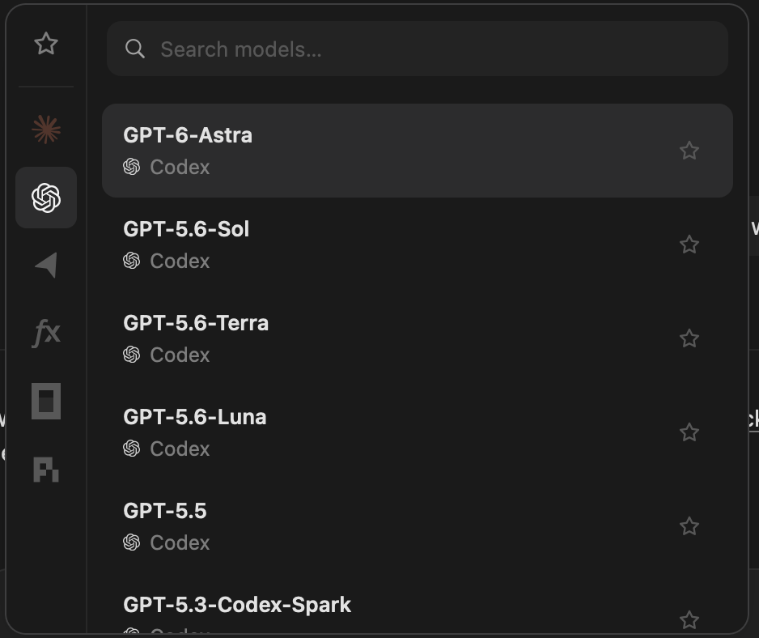

- The composer trigger displays the selected model and identifies its harness/provider.
- A search field at the top filters model choices by model name and harness/provider label.
- A side rail filters by harness/provider and includes a Favorites view, following the reference's organization.
- Each row shows a model name, a secondary harness/provider label, a selected state, and a star control for adding/removing a favorite.
- Users can favorite choices across harnesses/providers and select them from one Favorites list.
- Starring a row updates favorites without selecting that model, sending a message, or closing the picker.
- The reference's model names and provider icons illustrate layout; they are not a hard-coded catalog or a commitment to support additional harnesses in the first release.

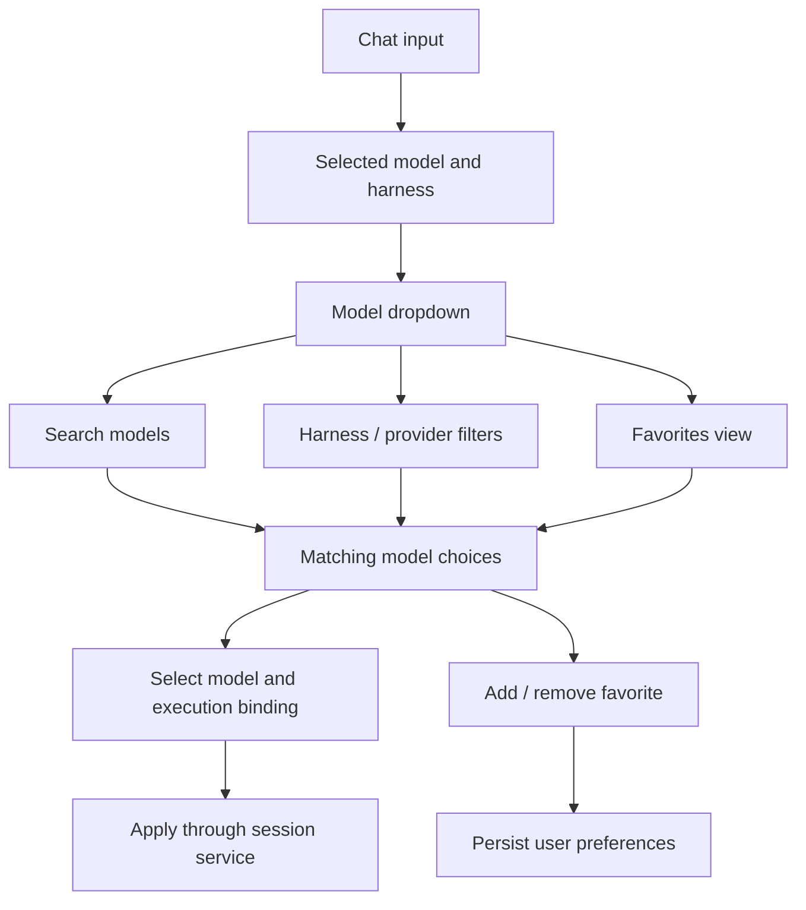

Catalog entries preserve model, model-provider, harness and configured instance identities. The same model through two different harnesses is two distinct execution choices, even when its display name matches. The UI renders normalized catalog entries and forwards a selection identifier; it does not construct native CLI arguments or parse provider-specific configuration.

Proposed preference behavior: favorites persist locally across tab switches and app restarts. Key favorites by the full execution choice rather than display name; retain unavailable favorites with a clear unavailable state so catalog refresh or a temporary login failure does not silently delete them. Favoriting never implies model availability or permission to use an account. Preference scope across multiple accounts/hosts can be finalized when those settings are designed.

The picker must handle loading, discovery failure, no search matches, no favorites, and unavailable choices. Provide keyboard navigation, accessible row and star labels, and a selected state that follows Cerebro's existing selection conventions. Model-specific options update from the newly selected entry's capabilities.

Selecting a different model respects session lifecycle rules: in-session changes apply only when supported, and selecting a different harness requires a new native session. The exact new-session/context-handoff interaction remains open; the picker must not silently discard history or claim cross-harness continuation. Changes during an active turn are governed by adapter capabilities and explicit timing, rather than mutating a running request unexpectedly.

Use safe Markdown and controlled artifact viewers. Arbitrary generated HTML or scripts must not execute in Electron's privileged context. Artifact storage/retrieval belongs to the host, with large binaries kept outside ordinary transcript events.

## 8. Tabs, panes, and workspace integration

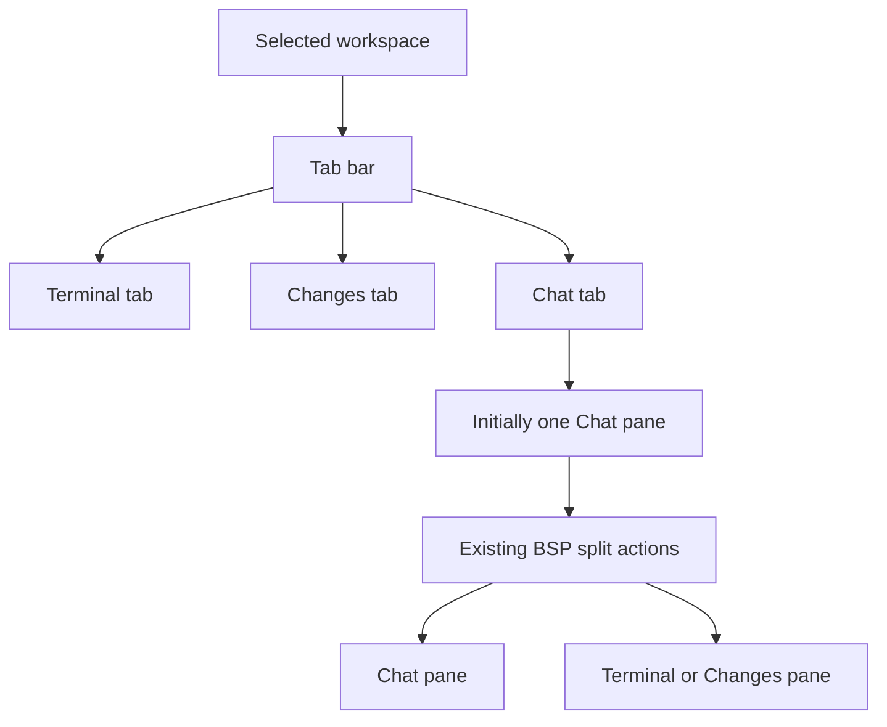

Add Chat to the New tab menu and pane split choices. Preserve existing Terminal and Changes behavior, tab ordering, keyboard focus, split sizing, and workspace selection semantics. The chat session uses the owning workspace/repository scope as its working directory; this is particularly relevant to multi-root workspaces.

Changing tabs or selecting another workspace only changes presentation. Existing agent work continues in the host. Closing a view, canceling a turn, stopping a runtime, and deleting conversation history are separate actions; closing a Chat pane detaches its view and retains both history and active work. Stop interrupts the active turn. Removing its workspace stops active agents before removal.

Do not assign a new shortcut or redesign the sidebar in this plan. Those changes are not necessary to establish Chat as a tab and pane kind.

## 9. Lifecycle, persistence, and recovery

Persist normalized conversation data and the opaque native resume binding separately. The normalized transcript is for presentation; the native binding restores the actual agent context. Do not resume by feeding the rendered transcript back as if it were native state.

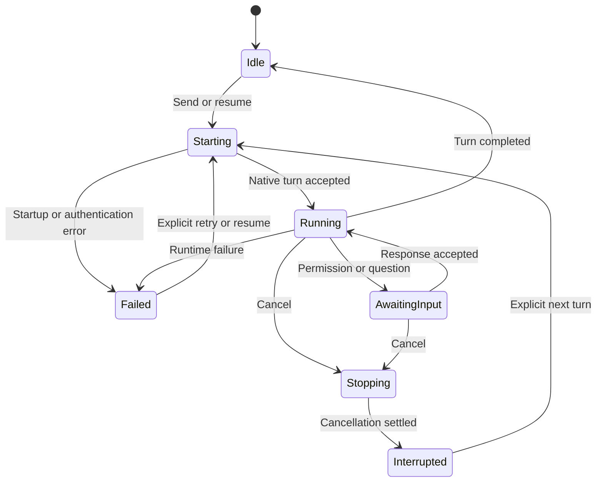

These are proposed service states, not final API enum names. Disconnected is client connection state and must not automatically mean that the agent stopped.

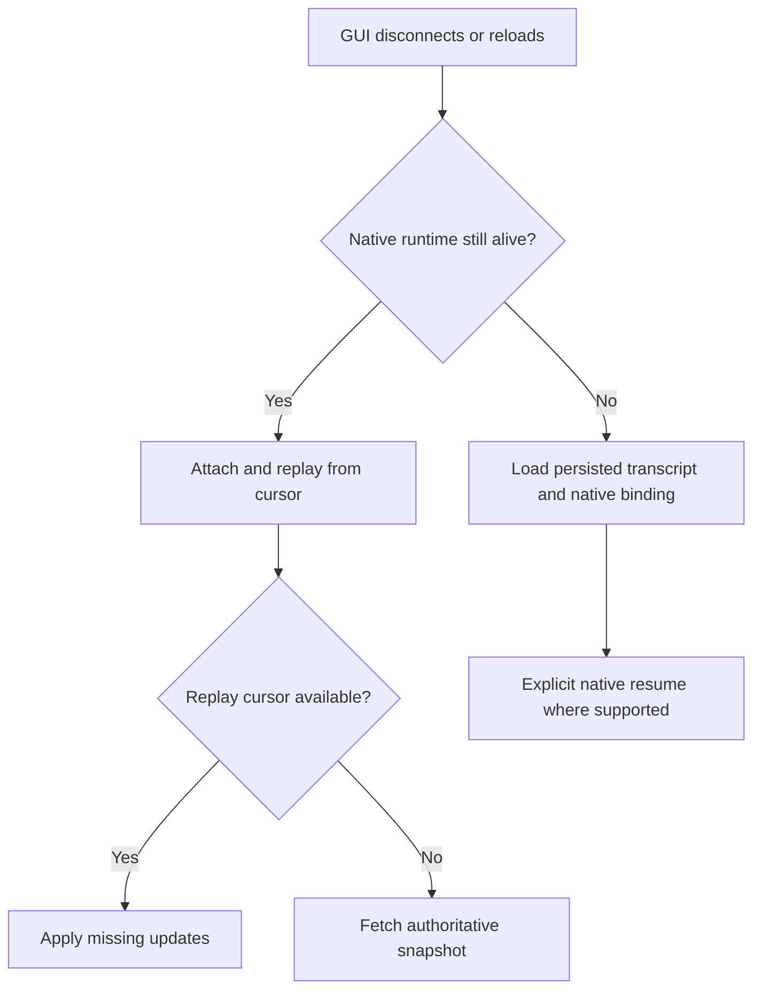

The service serializes lifecycle mutations per session and prevents duplicate submissions. Command IDs support deduplication within defined retention; this is not a promise of exactly-once execution across native process crashes. An uncertain dispatch is surfaced for reconciliation, not automatically resent.

Persist enough state to recover after host restart. An interrupted process does not continue executing simply because its transcript survived. Restore only permission requests with a valid native response channel; otherwise reconcile or mark them interrupted. Late events/cancellation from an old runtime or turn must not alter a replacement turn.

## 10. Models, configuration, and authentication

Prefer native model discovery where available; otherwise use a clearly identified fallback. Keep models and capabilities scoped to their harness instance. Do not offer every model under every harness or assume reasoning option values are interchangeable.

Expose a normalized catalog suitable for the unified composer picker: stable execution-choice identity, model ID/name, harness/provider labels, instance binding, availability, supported options, and discovery/fallback provenance. Catalog data and user favorites are separate so refreshes cannot overwrite preference state.

Model changes within a harness follow adapter capabilities. Switching harnesses creates a new native session; an explicit context handoff may be added later. The initial UI must not imply that Claude's internal session can become a Codex or Pi session transparently.

For Claude, the product intent is to reuse the user's existing native login/subscription through Claude's runtime. Preserve the user's real HOME and native credential access. Let the runtime manage storage and refresh; do not extract OAuth credentials to impersonate a generic model API client. If an API key or cloud configuration takes precedence, expose the effective mode rather than silently promising subscription billing.

The prior research records the corrected subscription guidance and conflicting older documentation. Recheck provider documentation and installed versions when implementing authentication. Apply the same host-side ownership principle to Codex and Pi; authentication behavior may differ by their selected model provider.

## 11. Transport and future extension

Normalization is a semantic contract. IPC, local sockets and WebSockets are delivery choices. The first local implementation should use the existing Electron/preload/host path unless implementation evidence warrants a different carrier.

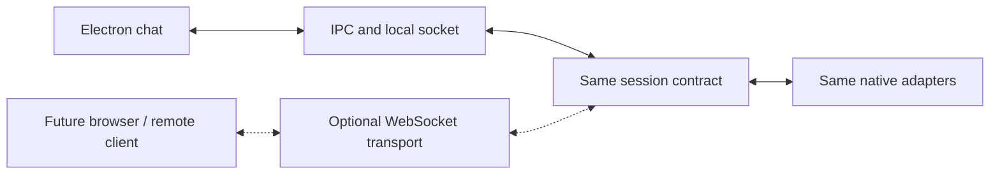

Remote authentication, encrypted network transport, host discovery, remote artifacts, and browser/mobile clients are future work. ACP integrations for Cursor, Grok, and others can be added behind the same contract without exposing their protocol to the chat UI.

## 12. Proposed implementation sequence

| Phase                        | Deliverable                                                                                                                      | Exit condition                                                                                                                             |
| ---------------------------- | -------------------------------------------------------------------------------------------------------------------------------- | ------------------------------------------------------------------------------------------------------------------------------------------ |
| 1. Contract design           | Commands, events, identities, capabilities, lifecycle and persistence rules                                                      | Representative traces from all three agents fit without provider-specific UI logic                                                         |
| 2. Host foundation           | Session service, registry, storage and typed local connection                                                                    | Sessions and event replay function independently of the renderer                                                                           |
| 3. Native adapters           | Claude SDK, Codex app-server, Pi RPC                                                                                             | Each supports core send/stream/cancel/resume and accurately reports optional capabilities                                                  |
| 4. Custom chat               | Transcript, composer, tool/diff/artifact views and request controls; unified model picker and favorites in the eventual UI scope | Shared UI handles all three adapters and unknown-content fallback; catalog contract supports filtering, selection and persistent favorites |
| 5. Layout integration        | Chat tab/pane creation, mixed splits and session binding                                                                         | Existing layout behavior remains consistent; tab switches preserve sessions/drafts                                                         |
| 6. Recovery and verification | Reconnect/restart cases, error handling, focused Electron evidence                                                               | Acceptance criteria below pass with limitations documented                                                                                 |

These phases can be developed as vertical slices, but completion requires all three named agents. Package boundaries should follow the architecture; exact folder names, storage schema and provider version pins belong in the later structure plan.

## 13. Acceptance and validation

- The same chat UI sends and renders real turns from Claude Code, Codex, and Pi RPC.
- The eventual composer model picker searches and filters valid choices by harness/provider, displays the active selection, and supports favorites across providers.
- Favorites persist across restart; starring does not select/send, duplicate model names retain distinct bindings, and unavailable favorites remain identifiable.
- Model selection routes to the correct adapter/instance and honors active-turn and cross-harness session constraints.
- Text and tool streams update stable items without duplicated final content.
- Supported permissions/questions round-trip correctly, including deny, failure and stale-request cases.
- Unsupported capabilities remain explicit; missing data is not invented.
- Images/files/diffs have useful renderers or clear fallbacks; long outputs stay usable.
- Native resume restores agent context where supported; uncertainty is reported otherwise.
- Switching tabs/workspaces and reloading Electron does not terminate active agents.
- Host restart restores transcript state without replaying uncertain prompts.
- Chat creation/splitting/focus/close follow the selected lifecycle policy and existing layout conventions.
- Credential inheritance works without logging secrets or unexpectedly switching billing modes.

Use recorded native frames for adapter contract tests and reducer cases. Run opt-in live native smoke tests with explicit versions/accounts because fixtures cannot prove provider compatibility. Test actual desktop interactions through Playwright against Electron, including mixed panes, streaming, requests, reconnect and error states; capture final screenshots. Follow AGENTS.md: lint/format/React Doctor only changed files and run only related tests. No tests are required for this planning-only document.

## 14. Initial implementation decisions

| Question                                             | Initial decision                                                                                                                                                                                                                                                                                                                                                                                                                          |
| ---------------------------------------------------- | ----------------------------------------------------------------------------------------------------------------------------------------------------------------------------------------------------------------------------------------------------------------------------------------------------------------------------------------------------------------------------------------------------------------------------------------- |
| What does closing Chat do?                           | Detach the view; keep active work and saved history. Stop explicitly interrupts a turn.                                                                                                                                                                                                                                                                                                                                                   |
| How are closed conversations reopened?               | The history selector at the top of a Chat pane, scoped to its workspace and repository.                                                                                                                                                                                                                                                                                                                                                   |
| What happens to a follow-up during a running turn?   | Sending queues the message by default (shown as a row above the composer, with a Steer button to fold it into the running turn immediately and a remove button). Confirmed native support: Claude Agent SDK streaming-input mid-turn fold, Codex app-server `turn/steer`, Pi RPC `streamingBehavior: 'steer'`. Steering one queued message never affects others; Stop leaves the queue intact and it becomes the next turn automatically. |
| What happens when a workspace is removed?            | Stop its active agents before removal. Saved transcripts remain on disk.                                                                                                                                                                                                                                                                                                                                                                  |
| How are first-run setup and account selection shown? | Per-harness setup errors in the model picker and native authentication errors in Chat. Account switching stays in the native CLI.                                                                                                                                                                                                                                                                                                         |
| When is the model picker delivered?                  | Included now: search, harness/provider filters, favorites, native catalog refresh and unavailable fallback rows. Switching harnesses requires a new native conversation.                                                                                                                                                                                                                                                                  |
| Which rendering libraries are used?                  | Custom React components, react-markdown/remark-gfm, and existing @pierre/diffs for valid patches.                                                                                                                                                                                                                                                                                                                                         |
| What are storage and retention limits?               | Private host-owned JSON snapshots with atomic replacement, 100 ms coalescing, bounded native frames, 100,000-character inputs, and a roughly 2 MB / 2,000-item conversation display limit. Start a new chat at the limit; pagination remains future work.                                                                                                                                                                                 |

## 15. Deferred work

Additional agents/ACP, browser/mobile clients, remote execution, multi-agent orchestration, automatic cross-harness handoffs, advanced branching/rewind UX, and a generic custom agent loop are outside the initial implementation. Preserve extension points without building these systems now.

## 16. Initial local implementation

The code is organized around `packages/core/src/chat.ts` (contract), `packages/mux/src/agents/` (native adapters, bounded JSON-lines transport, and persistent session service), and `apps/desktop/src/renderer/src/components/chat/` (custom renderer). Typed preload calls use the existing Electron IPC and authenticated mux connection.

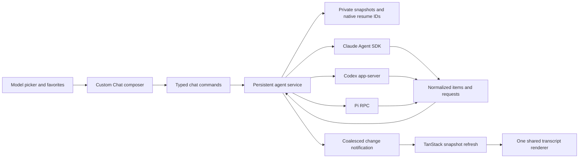

The initial transport sends authoritative snapshots after coalesced invalidations; it does not yet expose a replay cursor or paginated event journal. Logical session IDs, runtime generations, turn IDs, item IDs, request IDs, and accepted command IDs are distinct. Native IDs are persisted independently of display items. The service records an accepted prompt before starting a native turn, rejects concurrent sends, and does not automatically replay an uncertain turn after a crash.

One native runtime serves an active turn and is released afterward. The next turn resumes the native conversation using its saved binding. Model changes happen between turns within the same harness. New Chat detaches the current session; changing harnesses starts a separate native conversation rather than reusing displayed history as native context. Closing Electron through its existing complete-quit flow stops the mux and agents; renderer reload and tab switching do not.

Initial content coverage: text/Markdown, reasoning disclosure, tools and streamed output, plans, native diffs, supported permission requests and structured questions, notices, and errors. Pi extensions can ask confirm/select/input/editor questions. Unimplemented native server requests receive explicit errors, never implicit permission. Capabilities describe the adapter surface actually implemented.

Image attachments are implemented: the composer accepts dropped, pasted, or picked PNG, JPEG, GIF, and WebP images, downscales them in the renderer, and inserts an atomic `[Image #N]` chip at the caret. The host validates and stores the bytes under `CEREBRO_HOME/mux/agents/attachments/<session>/`, keeps only metadata in the session snapshot, and serves bytes back through a scoped retrieval call for transcript thumbnails and previews. Claude receives an image content block through streaming input, Codex receives `localImage` items with `text_elements` spans, and Pi receives the RPC `images` array. Model catalog entries carry `modalities`, and the composer refuses images for text-only models. See [the image attachment research](agent-chat-image-input-research.md) for the design. Non-image file upload, agent-produced artifact retrieval, graph previews, paginated transcripts, richer account/instance configuration, comprehensive usage reporting, queued follow-ups, steering, and additional native request families remain follow-up work. Markdown image output currently uses a textual fallback. Native configuration and credentials are inherited; the app does not claim that every catalog model is permitted by the current account, or that a configured API key uses subscription billing. The picker labels native-configured backends accordingly.

Storage is under `CEREBRO_HOME/mux/agents/`. Executable overrides are `CEREBRO_CLAUDE_PATH`, `CEREBRO_CODEX_PATH`, and `CEREBRO_PI_PATH`, applied in the host environment. After changing these variables or upgrading a previously running host, explicitly restart the Cerebro server. No credentials are copied into Cerebro's session files.

Verification uses deterministic native-protocol fixtures, session durability/cancellation tests, and actual Electron Playwright tests. Live local checks on 2026-09-13 discovered models through all three installed harnesses. Codex 0.154.0 and Pi 0.85.1 completed two-turn native resume checks. Claude Code 2.1.270 with SDK 0.3.270 discovered its models but the live prompt was blocked by an expired native OAuth session; protocol fixtures exercise its stream and permission integration without credentials.

### Verification results for this implementation

- Build and TypeScript checks passed for the shared core, mux, and desktop.
- Changed-file ESLint and Prettier checks passed.
- Nine focused adapter/service/transport tests passed, including Claude SDK permission callbacks and process teardown; three existing mux/CLI integration cases passed.
- Three Chat Electron cases passed. Four existing pane/CLI cases and five existing window smoke cases also passed. The added Chat cases cover all three native protocol fixtures, permissions/questions, cancellation, native resume binding, reload, host restart, persistent favorites, cross-harness new conversations, mixed panes, and missing-executable errors.
- Live Codex and Pi prompts resumed successfully with native context. Claude live authentication remains blocked by its expired native OAuth session; no account credentials were changed.
- React Doctor was run on all ten changed renderer files and reports seven advisory findings. The request option lookup is a small UI list; external-link `preventDefault` deliberately routes navigation through Electron; Chat's orchestration component has a complexity warning. The terminal-stack readiness callbacks/complexity and the tab-row nested close control predate this work. No diagnostics were suppressed. The diff key and the new floating callback finding were fixed.
- Final screenshots were inspected in the actual Electron app using deterministic native fixtures. No browser-only renderer verification was used.
