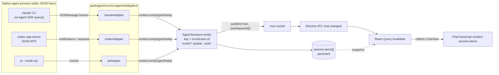
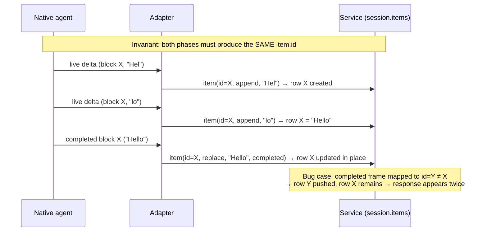

# Agent stream shapes: native frames to Cerebro items

Reference for how each native agent streams a response, what Cerebro stores, and the one rule that keeps a response from appearing twice. Verified against `packages/mux/src/agents/adapters/{adapter,shared,claude,codex,pi}.ts`, `transport.ts` and `service.ts`, `packages/core/src/chat.ts`, and the Claude Agent SDK types (`sdk.d.ts`, 0.3.287). Behavior not provable from types is marked _unverified_.

## 1. Transport: none of it is WebSocket or SSE

| Hop                      | Mechanism                                                                                                                                          | Payload                                       |
| ------------------------ | -------------------------------------------------------------------------------------------------------------------------------------------------- | --------------------------------------------- |
| Native agent → adapter   | Child process stdio, newline-delimited JSON (`JsonProcess`) for Codex and Pi; the Claude SDK spawns the `claude` CLI and exposes an async iterator | Native frames (shapes below)                  |
| Adapter → service        | In-process callback `context.emit(AgentDelta)`                                                                                                     | `AgentDelta`                                  |
| Service → mux clients    | Authenticated local socket / named pipe, `peer.wire.send({ event: 'chat', data: { workspaceId } })`                                                | **Notification only, no content**             |
| Electron main → renderer | IPC `IPC.chat.changed`                                                                                                                             | `{ workspaceId }`                             |
| Renderer                 | React Query `invalidateQueries(['chat', workspaceId])`, then refetch `ChatView`                                                                    | **Full session snapshot** (`session.items[]`) |

Consequence: the renderer never replays deltas. It always renders `session.items`, so a duplicate on screen is a duplicate row in `session.items`, created in `service.ts`.



## 2. The Cerebro shape (the normalized layer)

`packages/core/src/chat.ts`:

```ts
type AgentDelta =
  | { type: 'item'; item: Omit<ChatItem, 'turnId'>; append?: boolean }
  | { type: 'binding'; nativeId: string }
  | { type: 'checkpoint'; turnId: string; chainId: string }
  | { type: 'evict'; ids: string[] }
  | { type: 'usage'; usage: AgentContextUsage }

type ChatItem = {
  id: string // stored as `${turnId}:${id}`
  turnId: string
  kind: 'user' | 'text' | 'reasoning' | 'tool' | 'diff' | 'plan' | 'notice' | 'request'
  text: string
  title?: string
  input?: string
  status?: 'running' | 'completed' | 'failed' | 'interrupted'
  // attachments, request omitted
}
```

Service semantics (`service.ts`, `emit`):

- Key is `${turnId}:${item.id}`. Existing key is merged in place; a new key is appended as a new row.
- `append: true` concatenates `text`; otherwise `text` is replaced.
- Therefore **one logical block must always map to one `item.id`**, regardless of which native frame carries it. This is the whole contract.

## 3. Native shapes

### Claude (Agent SDK, `includePartialMessages: true`)

| Frame             | Shape (relevant fields)                                                                                                                                                                                                                                    | Role                                                                                                              |
| ----------------- | ---------------------------------------------------------------------------------------------------------------------------------------------------------------------------------------------------------------------------------------------------------- | ----------------------------------------------------------------------------------------------------------------- |
| `stream_event`    | `event`: `message_start{message.id}`, `content_block_start{index, content_block}`, `content_block_delta{index, delta: text_delta / thinking_delta / input_json_delta}`, `content_block_stop{index}`, `message_delta`, `message_stop`; `parent_tool_use_id` | Live preview; no `uuid` bookkeeping                                                                               |
| `assistant`       | `message{id, content: [ONE block], stop_reason: null}`, `uuid`, `supersedes?`, `aborted?`, `error?`, `parent_tool_use_id`                                                                                                                                  | Authoritative completed block. **While streaming, one frame per completed block, each carrying only that block.** |
| `user`            | `message.content[]: tool_result{tool_use_id, content, is_error}`                                                                                                                                                                                           | Tool output                                                                                                       |
| `result`          | `subtype`, `is_error`, `errors`                                                                                                                                                                                                                            | End of turn                                                                                                       |
| `system`          | `init`, `compact_boundary`, `model_refusal_fallback{retracted_message_uuids}`                                                                                                                                                                              | Lifecycle                                                                                                         |
| `control_request` | `can_use_tool`                                                                                                                                                                                                                                             | Approvals (via `canUseTool`)                                                                                      |

Native ids available: `message.id`, block `index` (stream only), `block.id` (tool_use only), frame `uuid`.

### Codex (`codex app-server`, JSON-RPC notifications)

| Frame                                          | Shape                                                                 | Role                                    |
| ---------------------------------------------- | --------------------------------------------------------------------- | --------------------------------------- |
| `turn/started`                                 | `turn.id`                                                             | Lifecycle                               |
| `item/started`                                 | `item{type, id, ...}`                                                 | Create row, `status: running`           |
| `item/agentMessage/delta`                      | `itemId, delta`                                                       | Append text                             |
| `item/reasoning/summaryTextDelta`, `textDelta` | `itemId, delta`                                                       | Append reasoning                        |
| `item/commandExecution/outputDelta`            | `itemId, delta`                                                       | Append tool output                      |
| `item/completed`                               | `item{type, id, text / aggregatedOutput / changes, status, exitCode}` | Final snapshot                          |
| `turn/plan/updated`                            | `plan[{step, status}]`                                                | Flat plan (currently flattened to text) |
| `turn/diff/updated`                            | `diff`                                                                | Turn diff                               |
| `thread/tokenUsage/updated`                    | `tokenUsage.last / modelContextWindow`                                | Usage                                   |
| `turn/completed`                               | `turn.status`                                                         | End of turn                             |

Native ids available: `itemId` / `item.id` on every frame. **No id derivation needed.**

### Pi (`pi --mode rpc`, events)

| Frame                                 | Shape                                                                           | Role                                |
| ------------------------------------- | ------------------------------------------------------------------------------- | ----------------------------------- |
| `message_start`                       | `message.role`                                                                  | We mint `messageId = randomUUID()`  |
| `message_update`                      | `assistantMessageEvent{type: text_delta / thinking_delta, contentIndex, delta}` | Append                              |
| `message_end`                         | `message{content: [ALL blocks], stopReason}`                                    | Final snapshot, whole content array |
| `tool_execution_start / update / end` | `toolCallId, toolName, args / partialResult / result, isError`                  | Tool lifecycle                      |
| `agent_end`                           |                                                                                 | End of turn                         |
| `extension_ui_request`                | `method: confirm / select / input / editor`                                     | Questions                           |

Native ids available: `toolCallId`; text and reasoning use our own `messageId:contentIndex`.

## 4. Side by side: how one text block becomes one item

|            | Live phase                           | Final phase       | Item id                                           | Final phase carries                                                                                        |
| ---------- | ------------------------------------ | ----------------- | ------------------------------------------------- | ---------------------------------------------------------------------------------------------------------- |
| **Claude** | `stream_event` `content_block_delta` | `assistant` frame | `message.id:blockIndex` (`block.id` for tool_use) | **One block**, so the id comes from a per-message slot table filled by the stream, not `content.entries()` |
| **Codex**  | `item/*/delta`                       | `item/completed`  | `itemId` (native)                                 | One item                                                                                                   |
| **Pi**     | `message_update`                     | `message_end`     | `messageId:contentIndex`                          | All blocks, so `entries()` index is correct                                                                |



## 5. Why the response appeared twice (fixed)

Claude's `assistant` frame holds one block, so `content.entries()` always yielded index 0. With a thinking block at stream index 0 and text at index 1:

- streamed text: `msg:1`
- completed text frame: `msg:0`, colliding with the reasoning item `msg:0`

The reasoning row was overwritten with the answer text and the streamed `msg:1` row stayed, giving two copies of the answer and no thinking block. Text-only replies (index 0 on both paths) were unaffected, which made it intermittent.

Fix: `claudeAdapter` registers each streamed block in a per-message slot table (`unclaimed`) at `content_block_start`. A completed `assistant` block claims the first unclaimed slot of its kind (tool blocks match by `block.id`), so a streamed block with no completed frame cannot shift later blocks. With no slots (resumed or non-partial output) it falls back to the block's position in the message. `content_block_stop` marks text and reasoning `completed` as soon as the block closes. Regression tests in `adapters.test.ts`: "reuses streamed item ids for single-block assistant frames…" (fixture `thinking-then-text`) and "keeps later blocks on their streamed ids when an earlier block has no completed frame" (fixture `skipped-block`).

## 6. Rules for the normalized layer

1. **One id function per provider**, called from both the live and the final path. Never derive the same id in two places.
2. Native ids win. Codex already gives them; Claude tool_use blocks give `block.id`. Only synthesize an id when the native frame has none (Claude text and thinking, Pi).
3. Live frames only ever `append` to, or create, a row. Final frames only ever replace and set `status`.
4. A provider test must stream then complete one message and assert the exact set of `[id, kind]` pairs, including a thinking-then-text case.
5. Unhandled-but-available native signals, tracked as follow-ups: Claude `assistant.aborted` and `assistant.error`.

## 7. Open items

- Residual assumption: two streamed blocks of the same kind that both reach `assistant` frames do so in stream order, since text and thinking blocks have no native id to match on. If the CLI ever dropped the earlier of two same-kind blocks, the later frame would claim the earlier slot. _Unverified against a live CLI._
- Todo/plan: Codex `turn/plan/updated` and Claude `TodoWrite` are not yet normalized into a structured delta (see the earlier proposal for a `todos` delta type).
