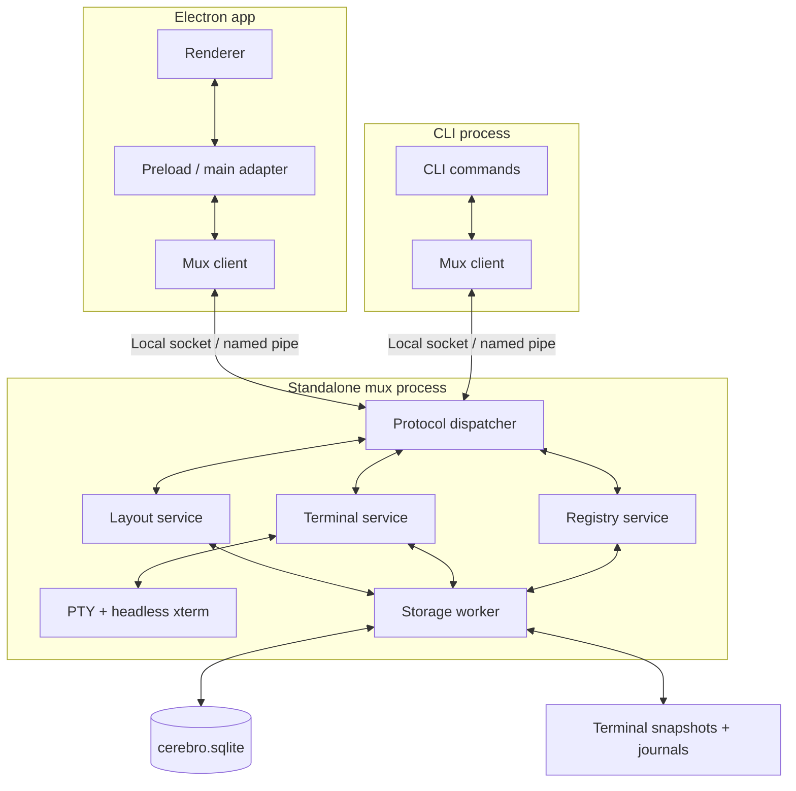

# Cerebro mux implementation structure

Status: implemented locally. See [runtime behavior, measurements, and remaining platform release checks](mux-runtime.md). This document records the reviewed design; concrete implementation details and deviations are recorded in that runtime guide.

Reviewed 2026-09-11 against `ae08a83f17a6c81c0c3d678f78531c504bf24c5b` in `/Users/alvistse/Documents/dev/cerebro`.

## Outcome and constraints

Keep the existing mixed Terminal/Changes BSP tabs and CLI behavior. Move layout and shell ownership to a standalone local mux so closing Electron does not stop shells. Restore layout and bounded terminal output after a daemon restart or reboot; a restored shell is a new process, not a resumed command.

- Support macOS, Linux, and Windows, using the bundled Node runtime.
- Preserve 10,000 scrollback rows per terminal by default, configurable independently of pane count.
- Batch terminal durability toward a one-second loss target under normal storage conditions. Report delayed/failed persistence instead of promising this during storage failure.
- Workspace creation, tab creation, splitting, capture, and input must work with Electron closed.
- Reuse current pane geometry, focus, collapse, reorder, shortcuts, and theme behavior. No pane UI redesign, remote hosting, or interactive CLI terminal attachment in this version.

## Baseline inspected for the plan: reuse and replace

| Component                              | Verified state                                                                                              | Mux change                                                                                                         |
| -------------------------------------- | ----------------------------------------------------------------------------------------------------------- | ------------------------------------------------------------------------------------------------------------------ |
| `packages/core/src/panes.ts`           | Shared `PaneNode`, `WorkspaceTab`, `LayoutState`, and `LayoutCommand`; numeric IDs include splits           | Preserve BSP shapes and commands; add persistent identity, pane state, and stream contracts                        |
| `apps/desktop/src/main/panes.ts`       | Layout and ID allocator are in memory; every mutation broadcasts all workspaces                             | Extract Electron-free layout service; commit before acknowledgment; emit changed-workspace events                  |
| `apps/desktop/src/main/pty.ts`         | Sessions know workspace and WebContents, but not pane; every open spawns a shell                            | Map one terminal pane to one current session; daemon owns spawn, IO, resize, exit, and termination                 |
| Renderer `terminal-stack.tsx`          | Mount spawns; cleanup kills; all tabs remain mounted; process exit closes the pane                          | Attach/detach independently of shell lifetime; mount the visible tab; keep exited panes readable                   |
| Renderer pane geometry/components      | Mixed BSP leaves, fixed split direction, draggable ratios, sibling collapse                                 | Retain and feed from the mux layout subscription                                                                   |
| Renderer `changes-view.tsx`            | Selected file and file-list visibility/width are component state                                            | Persist view state per pane; reload actual diffs from Git                                                          |
| Desktop socket and CLI layout commands | One-request JSON socket owned by Electron; CLI requires desktop                                             | Shared persistent mux client; auto-start daemon; preserve existing command syntax                                  |
| Project/workspace services             | CLI calls core directly; desktop supplies a Git provider; even `listProjects()` can upgrade stored projects | Coordinate registry access through mux; preserve provider/auth behavior and avoid assuming reads are mutation-free |
| Desktop startup/shutdown               | Clears active workspace at startup; kills all PTYs on quit                                                  | Restore valid selection; desktop quit only detaches                                                                |
| Bundled CLI                            | Already ships Node, CLI bundle, target metadata, and license                                                | Extend build to ship mux and Node-compatible PTY native assets                                                     |

## Structure and ownership



### C1 — Shared contracts and stable identity

**Placement:** retain `packages/core/src/panes.ts`; add an Electron-free `packages/mux` package for client, protocol, services, storage adapter, and executable entrypoint. Keep renderer imports type-only so they do not pull Node code into the browser bundle.

- Preserve numeric `projectId`, `workspaceId`, `tabId`, `paneId`, and `splitId`. Allocate tab/pane/split IDs from one persisted, monotonic sequence to retain current uniqueness assumptions. Never recycle deleted IDs.
- Add a distinct session generation for each shell launch. A stale renderer must not send input or resize to a replacement shell.
- Keep `repositoryId` as the canonical repository identity. Expose `--sub-repo` for optional pane scope, mapping to that existing ID rather than introducing another repository table.
- A workspace row still owns its tabs. A multi-root parent defaults to no repository scope; a nested repo row defaults to its own repository. Validate explicit scope against the project and row. Never infer root scope from its legacy first-repository foreign key; defer broad root-schema migration.
- Inject project/workspace/tab/pane IDs and the effective repository/sub-repo ID into shell context. Clear inherited Cerebro identity variables before setting the new context. Root-wide terminals omit repository identity; CWD is the root folder, or selected repository checkout when scoped.
- Add versioned pane content state: terminal launch configuration; Changes selected repository/file, file-list visibility, and width. Unknown future kinds retain stored state and render an unsupported-content placeholder.
- Keep `WorkspaceTab.kind` as compatibility/presentation metadata; pane kinds determine content.

**Core interfaces (proposed):**

```ts
connectMux(options: ConnectOptions): Promise<MuxClient>
client.layout(command: LayoutCommand): Promise<LayoutReply>
client.subscribeLayout(listener: LayoutListener): () => void
client.attachTerminal(target: PaneTarget): Promise<TerminalAttachment>
client.detachTerminal(attachmentId: string): Promise<void>
client.writeTerminal(target: SessionTarget, data: string): Promise<void>
client.resizeTerminal(target: SessionTarget, cols: number, rows: number): Promise<void>
client.captureTerminal(target: PaneTarget, options: CaptureOptions): Promise<CaptureResult>
client.restartTerminal(target: PaneTarget): Promise<SessionInfo>
client.setPaneState(target: PaneTarget, state: VersionedPaneState): Promise<void>
client.workspaceCreate(projectId: number, branch: string, from?: string): Promise<Workspace>
```

`PaneTarget` contains workspace and pane IDs; `SessionTarget` also contains the session generation. Mutating requests have IDs for response correlation and retry deduplication. Never retry terminal input automatically after uncertain delivery.

### C2 — Daemon lifecycle, transport, and runtime

- One mux per resolved data-directory/database configuration. Both clients resolve the same identity, including `CEREBRO_DB_PATH`; reject conflicting home/database combinations rather than opening competing owners.
- Use a dedicated mux Unix socket on macOS/Linux and a per-user named pipe on Windows. Retire Electron's layout socket owner. Probe a live endpoint before attempting stale-socket cleanup; concurrent starts must converge on one daemon.
- Start on demand from desktop or CLI, detached from the parent with independent stdio and a readiness handshake. No login service is required for v1; after reboot the first client starts recovery.
- Negotiate protocol and storage versions. Incompatible clients fail clearly and do not kill an active daemon. Compatible app upgrades reconnect; incompatible upgrades require explicit server restart, with saved output and fresh shells afterward.
- Frame small JSON control messages separately from bounded terminal data frames. Include request IDs, session generation, output sequence, and daemon epoch. Chunk large snapshots; do not route history through the current one-line/4 MB CLI response parser.
- Keep socket/pipe access local to the current user. Use owner-only local files and an installation token for the handshake, with the Windows token file protected by the user's ACL.
- Extend the existing CLI build/runtime check to bundle mux assets and a `node-pty` build for the shipped Node ABI. Do not reuse Electron's native addon binary. Preserve Node license/signing checks and test each target architecture.
- Runtime assets needed by the daemon must survive app replacement and AppImage unmounting: stage a versioned runtime under the data directory, atomically validate it, and retain versions used by live daemons. Bound diagnostic logs.

### C3 — Durable layout and registry coordination

- Store one versioned BSP document per workspace in SQLite, with active tab, active panes, labels/order, split IDs/ratios, and durable revision. Store pane content/session metadata separately by pane ID. Allocate IDs and update layout in the same transaction.
- Extract the current layout algorithms rather than rewriting them. Persist before acknowledging a mutation, then publish only the affected workspace. Bootstrap/reconnect returns a full snapshot; epoch plus revision prevents stale responses replacing recovered state.
- Coalesce divider interaction on the client and commit its final ratio; do not perform synchronous writes on every pointer event.
- Use a storage worker for SQLite operations and terminal file writes so `DatabaseSync`, fsync, and checkpointing do not run on the PTY event loop. Keep PTY handles in the daemon thread, not shared among workers.
- Route project/workspace creation, removal, and discovery upgrades through a registry service. Serialize conflicting operations per project/workspace; do not hold SQLite transactions while Git runs.
- Preserve the desktop Git provider through an operation-scoped provider adapter: desktop requests can delegate required Git execution back to the initiating main process. CLI operations use system Git credentials and must not depend on a connected desktop or decrypt Electron credentials. Never persist credential payloads.
- Keep GitHub PR polling, query caching, login UI, and unrelated settings in their current layer. They are outside mux ownership.
- Create a workspace with an empty layout. Explicit terminal tab/pane creation persists the pane and starts its shell in the daemon, even with no renderer. A spawn failure retains a retryable failed pane rather than inventing a running session.
- Validate removal restrictions before terminating shells. Block concurrent new panes during removal, stop owned sessions, perform removal, then purge layout/history after success. On filesystem failure, retain the registered workspace and mark any stopped sessions honestly; do not claim rollback resurrected them.
- On startup reconcile pending creation/removal records and missing directories. Keep unrelated workspaces usable. Existing project/workspace IDs remain unchanged; there is no old on-disk pane layout to migrate.

### C4 — Terminal state, streaming, and disk recovery

- One PTY and authoritative headless xterm instance per live terminal pane. Match renderer/headless VT options and compatible package versions, including Unicode width and `convertEol` behavior.
- Terminal creation is a service operation; attachment never blindly spawns another shell. Default headless geometry is 80×24; retain last valid dimensions while detached. Visible desktop attachment owns subsequent geometry; capture clients cannot resize. A second desktop view is read-only unless it explicitly takes ownership.
- Process output, resize, and snapshots in one ordered stream. An attachment receives a snapshot through sequence N and subsequent events after N, without a gap or duplicate. Restore at the saved dimensions before applying a new size.
- The daemon alone answers terminal device queries. Suppress renderer-generated replies and all replay side effects, so attached clients cannot produce duplicate responses. Forward user keyboard/paste input through a separate path.
- Maintain bounded per-client queues. A slow/disconnected renderer falls back to snapshot resynchronization; it does not hold unbounded output or pause unrelated panes. Apply PTY backpressure when the authoritative parser/storage queue reaches its high-water mark.
- Keep metadata in SQLite and terminal snapshots/journals in `CEREBRO_HOME/mux/terminals/<paneId>/<generation>/`. Journal ordered output and resize events in checksummed records. Recover only complete records.
- Batch file flush/fsync on a one-second cadence for dirty sessions. Checkpoint dirty terminals periodically and by journal-size threshold. Write and sync a new snapshot before switching its manifest and reclaiming covered journal segments. Retain a previous valid checkpoint until the new generation is recoverable.
- Retention is the configured scrollback plus visible screen, not a lifetime transcript. Rotate journals only after a valid checkpoint; apply bounded queue/journal budgets and report persistence degradation on disk-full or sustained write failure. Never silently grow storage indefinitely.
- Snapshot correctness is a release gate: xterm serialization does not promise a complete parser checkpoint. Prove handling of split escape sequences, resize ordering, normal/alternate buffers, cursor, and modes. Persist decoder/parser continuation where needed or retain a sufficient replay prefix; do not silently resume from an unsafe boundary.
- App quit/reload detaches and preserves the process. Explicit pane/tab close terminates its terminals and deletes retained output. Natural shell exit retains an exited pane and final output, with a Restart action; this deliberately replaces today's auto-close behavior.
- After daemon death/reboot, mark old sessions interrupted and restore their output. Start a fresh shell on first terminal activation or explicit CLI restart, using saved launch configuration and a valid last-known CWD (otherwise launch CWD). Show a restart boundary and reset interactive modes before new shell output. Preserve an interrupted alternate screen as a read-only previous-session view, not a fake running TUI.
- Do not replay commands or saved environment dumps. Persist launch settings and track CWD through supported shell reporting; document fallback when a shell cannot report it.

### C5 — Desktop integration and pane content restoration

- Replace main-process layout/PTY owners with mux adapters and preload subscriptions. Renderer code remains behind `window.cerebro`; it never opens local sockets directly.
- Preserve the current BSP positioning, pane IDs, split controls, focus highlighting, tab order, and keyboard behavior. A desktop tab/pane focus command selects its workspace as today; headless focus persists selection without opening Electron.
- Mount terminal renderers only for the selected visible tab. Detach on unmount and restore from the daemon when revisited. Headless terminals continue collecting output. Keep all visible split panes rendered; only the active pane accepts keyboard focus.
- Remove mount-driven PTY creation, cleanup-driven killing, app-start selection clearing, and renderer-owned exit removal.
- Connect Changes view state to pane ID and persist selected file and file-list settings. Fetch current diffs when visible; if the selected file disappeared, use the existing first-file/empty fallback. Do not store stale diff bodies or GitHub query results as pane state.
- Expose connecting, interrupted, exited, spawn-failed, and persistence-degraded states without making a disconnected pane look live.

### C6 — CLI compatibility and additions

Preserve all current `workspace`, `tab`, and `pane` syntax and JSON/error conventions. Replace desktop-required connection logic with the common mux client.

```text
cerebro workspace create --project <id> --branch <name> [--from <base>]
cerebro tab create --workspace <id> [--kind terminal|changes] [--sub-repo <id>]
cerebro pane split --workspace <id> [--pane <id>] [--tab <id>]
                   [--kind terminal|changes] [--direction auto|right|down] [--sub-repo <id>]
cerebro pane capture --workspace <id> --pane <id> [--scrollback <rows>] [--format text|ansi]
cerebro pane send --workspace <id> --pane <id> --text <text> [--enter]
cerebro pane restart --workspace <id> --pane <id>
cerebro server status|start|stop
```

- Existing tab/pane list/focus/close/reorder/resize commands remain available. Preserve result fields, adding context/session status rather than renaming IDs.
- `capture` defaults to visible screen as text; optional scrollback is bounded by retention. Return JSON containing data, dimensions, pane/session identity, and sequence. Capturing an interrupted pane does not launch a shell.
- `send` sends literal text, appending carriage return only with `--enter`; reject nonterminal, interrupted, or exited targets. Input acknowledges queue acceptance, not command completion.
- `restart` is explicit and may terminate the current shell; allocate a new session generation. `server stop` checkpoints and terminates all owned shells while retaining layout/history. `server status` never auto-starts.
- Preserve workspace-create branch/conflict rules and ID/path results. Provide long-operation handling rather than reusing the current five-second layout timeout. Uncertain workspace-create results are reconciled by operation ID, never blindly duplicated.
- Preserve current `auto` split orientation: latest measured dimensions, otherwise 1200×800, subdivided after a headless split. This is pane pixel geometry, separate from terminal character geometry.
- Add Windows CLI launcher support to packaging; the current one-click installer is Unix-only. Retain development/production command isolation and existing installer ownership checks.

## Delivery slices and verification

The slices below describe the implementation and its acceptance contract. The runtime guide records measured verification and outstanding release checks.

| Slice | Deliverable                                                                  | Depends on                           | Acceptance/verification                                                                                                                                                |
| ----- | ---------------------------------------------------------------------------- | ------------------------------------ | ---------------------------------------------------------------------------------------------------------------------------------------------------------------------- |
| S1    | Extract layout engine, add persistent IDs, scoped pane state, protocol types | —                                    | V1: existing BSP semantics; cross-workspace rejection; IDs and revisions survive reload; migration preserves project/workspace IDs                                     |
| S2    | Package/start/connect daemon, storage worker, registry coordination          | S1                                   | V2: concurrent launch yields one owner; CLI creates workspace with desktop closed; provider-backed desktop operations still work; no terminal IO blocked by Git/SQLite |
| S3    | Daemon-owned PTYs, headless state, attach/stream/capture/input               | S1, S2                               | V3: exactly one shell per pane; CLI-created shells run headlessly; attach during output loses/duplicates nothing; query responses occur once                           |
| S4    | Journal/checkpoint recovery and bounded retention                            | S3                                   | V4: crash injection during snapshot/rotation; torn journal; resize/Unicode/alternate-screen/parser continuation; durable watermark and disk-full behavior              |
| S5    | Desktop adapters, visible-tab rendering, Changes state, restart UI           | S2, S3; recovery completion needs S4 | V5: Electron reload/quit preserves shell identity; restart restores IDs/layout/content; hidden terminals continue; existing pane interactions remain correct           |
| S6    | CLI commands and bundled cross-platform delivery                             | S2, S3; recovery checks need S4      | V6: workspace/tab/pane flow without desktop, error compatibility, stale generations, Windows launcher and native-addon smoke tests                                     |
| S7    | Integration, performance measurements, lifecycle documentation               | S4–S6                                | V7: packaged app close/reopen, daemon restart, version mismatch, runtime survival across app replacement, resource budgets                                             |

S4, the initial S5 integration, and S6 can proceed independently after the shared S3 protocol is settled. Integrate through the common client rather than adding separate desktop and CLI state owners.

### Test and benchmark contract

- Add focused mux unit/integration tests for V1–V4/V6; launch real daemon processes with isolated data directories. Stop test daemons explicitly before deleting fixtures.
- Extend `panes.spec.ts` and `terminal.spec.ts`; replace the current “desktop not running means unavailable” assertion with successful daemon auto-start. Add a focused `mux.spec.ts` for actual Electron close/relaunch against the same home, with deterministic daemon cleanup.
- Use `changes.spec.ts` for persisted Changes selection/rail settings, `projects-github.spec.ts` for workspace creation/provider compatibility, and `projects-directory.spec.ts` for root/sub-repo identity and deletion. Run only affected cases/specs during each slice.
- Benchmark 1, 10, and 50 terminals, 10,000-row histories, idle sessions, one noisy session, and all sessions producing output. Record hardware/runtime, p50/p95 input-to-paint and reconnect latency, RSS, CPU, bytes written, and durable-watermark lag.
- Initial engineering targets for review: visible-pane p95 input-to-paint below 50 ms under background output; 10,000-row reconnect below 500 ms on the reference machine; steady-state retention/queues plateau rather than growing with session age; no sequence loss while the daemon stays alive. These are targets, not measured claims.
- Compare hybrid journal files against batched SQLite output storage using the same workload and durability settings before optimizing. Hybrid storage is the proposed default; a change in storage architecture requires updating this handoff with evidence.
- Run changed-file lint/format checks and related tests for code slices. Local measurements are recorded in `mux-benchmark.json` and `mux-storage-benchmark.json`; renderer paint and other-platform numbers are not yet measured.

## Review decisions and risks

The proposal retains the previously selected platform, mixed-content, history, and crash-loss requirements. The following defaults are new and should be reviewed together:

1. Exited terminals keep their pane/output and offer Restart instead of closing automatically.
2. Reboot recovery creates new shells on first activation; it never reexecutes previous commands. Interrupted alternate-screen content remains inspectable separately.
3. Scope `subRepoId` to an existing repository identity without restructuring workspace rows.
4. Use the bundled Node runtime and hybrid storage, with a separate storage worker; no native rewrite or remote mux in v1.
5. Preserve desktop Git authentication through the provider adapter while headless CLI uses system credentials.

The principal release gates are faithful terminal reconstruction, native runtime packaging on all targets, and maintaining latency during parsing/checkpoint work. Serializer behavior and throughput must be demonstrated in S3/S4; the structure is not evidence those gates already pass.

## References

- [xterm 5.5 serialization contract](https://raw.githubusercontent.com/xtermjs/xterm.js/5.5.0/addons/addon-serialize/typings/addon-serialize.d.ts): supports restoring rows/cursor and recommends restoring at original dimensions; not a documented full parser checkpoint.
- [xterm flow control](https://xtermjs.org/docs/guides/flowcontrol/): use bounded queues and completion-aware flow control across asynchronous transports.
- [node-pty platform and thread-safety notes](https://github.com/microsoft/node-pty): native platform support; PTY instances must not be spread across Node worker threads.
