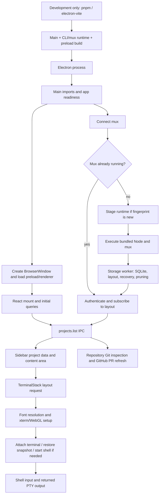

# Electron startup investigation — September 12, 2026

The largest measured fresh-start bottleneck is staging and first executing the mux runtime. A separate development build race can start Electron before that runtime exists. The race is fixed in this task; the runtime-cache redesign below is a measured proposal, not a shipped optimization.

The measurements below predate the splash-screen follow-up described at the end of this document.

**Measured results**

These are real Electron runs on this Mac, using the current dirty checkout, Electron 39.8.10, and bundled Node 24.11.0. Each built-app scenario has three samples. Times start immediately before Playwright launches Electron; development timings start before spawning `pnpm --filter desktop dev`.

| Scenario                                                   | Median content available |         Range | Median terminal command round trip |
| ---------------------------------------------------------- | -----------------------: | ------------: | ---------------------------------: |
| Fresh profile, empty database, no staged runtime           |                  3.168 s | 3.108–3.280 s |                                  — |
| Cached runtime, stopped mux, one restored terminal         |                  0.886 s | 0.884–0.956 s |                            1.036 s |
| Live mux, one reattached terminal                          |                  0.968 s | 0.865–1.053 s |                            1.060 s |
| Fresh profile, experimental reuse of existing bundled Node |                  1.544 s | 1.532–2.722 s |                                  — |
| Fresh profile, experimental copy-on-write copy             |                  3.271 s | 3.159–3.274 s |                                  — |

The existing-Node experiment reduced median fresh startup by 51%. Its first sample was slower, so this is evidence for reusing an already-executed runtime, not a promise that the first installation will be equally fast. Copy-on-write alone did not improve startup in these samples.

A final rebuilt verification batch (nine more launches) measured medians of 2.755 s fresh, 1.004 s with a stopped mux, and 1.075 s with a live mux. The build-hook fix does not change runtime staging; these differences illustrate machine/cache variation across non-interleaved batches. Treat the experimental percentage as a directional result, not a stable performance guarantee.

After the development race fix, three launches using a database snapshot with the user's 3 projects, 6 repositories, and 8 workspaces reached project content in **5.383, 5.411, and 5.592 seconds**. Electron launched at 2.371–2.528 seconds, after the CLI/runtime build finished. These include compilation and fresh runtime staging; they are not comparable to the built-app launch timer.

**Startup dependency path**



- Main startup is in `apps/desktop/src/main/index.ts`. `getMux()` already starts asynchronously; the window does not await it. Main entry-to-import completion was approximately 17–28 ms in baseline samples. Window creation, Chromium startup, and rendering dominate the rest of ordinary subsecond window startup.
- `apps/desktop/src/main/mux.ts` shares one connection promise and awaits `subscribe` before resolving it. Project listing uses this same promise. Thus an asynchronous mux startup still blocks useful project content.
- `packages/mux/src/client.ts` hashes the whole runtime manifest, including `muxHash`, and stages the entire CLI directory for a new fingerprint. On this checkout that is approximately 189 MiB: 128 MiB of Node and 61 MiB of dependencies, plus the small JS bundles. A mux-code change therefore gives the same Node binary a new staged path.
- `packages/mux/src/server.ts` waits for the storage worker's initial layout before listening. `worker.ts` initializes SQLite/layout, prunes terminal files, and reconciles interrupted operations. These are possible large-profile costs, but cached-runtime measurements do not show them producing the multi-second delay here.
- `packages/core/src/projects.ts` performs directory-to-multi-root discovery during `listProjects()`. `use-projects.ts` then starts branch/remote inspection and PR refresh separately. GitHub is not an awaited dependency of initial local project data.
- `WorkspaceView` shows its loading state until projects finish, then mounts `TerminalStack`. The stack requests layout and mounts only the selected tab's panes. It does not restore every hidden terminal renderer at boot.
- Terminal initialization waits for fonts, constructs xterm and its renderer, attaches through IPC, writes the snapshot, and enables interaction. Median `pty.open` was 63 ms with a stopped mux and 2 ms with a live mux. The controlled shell had no user dotfiles.
- App, settings, dialogs, terminal, and Changes components are statically connected to the renderer entry. The entry is approximately 3.54 MB; the full renderer asset directory is about 19 MiB, but that does **not** mean all language chunks load during startup. Navigation-to-DOM-ready was 188–208 ms. Lazy loading is worthwhile secondary work, but bundle size alone does not explain the observed multi-second fresh-start wait.

**What the experiments establish**

The fresh baseline's runtime copy took 697–720 ms. Its initial project request took 1.894–1.990 seconds, much of it waiting for mux availability. With the runtime cached, the initial project request was generally 2–4 ms. These durations overlap; they must not be summed as independent phases.

The probe's existing-Node variant changes only the mux subprocess executable path to the already-built bundled Node. It retains the copied mux JS and dependencies. In the later two samples, spawn-to-project-result fell to approximately 0.27 seconds, with the copy still costing 0.64–0.67 seconds. This isolates a substantial penalty associated with executing the new Node copy. The exact macOS mechanism (for example executable validation or caching) has not been traced and should not be asserted as fact.

The live-vs-stopped terminal medians differ by only tens of milliseconds and overlap. There is no evidence here that reattaching a live mux is intrinsically slower; these small differences are ordinary run variation.

**Development race and implemented fix**

`cliBuildPlugin` used a plain asynchronous `closeBundle` hook. Rollup runs those hooks in parallel. electron-vite's watch-mode `closeBundle` hook resolves its startup barrier while Cerebro's hook is still rebuilding `out/cli` with `emptyOutDir: true`.

One captured run launched Electron at 1.418 s, failed its eager mux connection at 1.955 s, and failed project/layout IPC around 3.0 s. The worker JS was not finished until 2.823 s, and native assets/Node were copied afterward. Another run recovered because its project query happened later. This explains timing-dependent failures.

`apps/desktop/scripts/cli-build.ts` now declares that hook with `order: 'pre'` and `sequential: true`. Rollup waits for the completed runtime before invoking electron-vite's launcher/restart hook. This deliberately changes startup ordering and removes the race; it is **not** a measured reduction in compilation time. All existing build/copy/ABI-validation behavior is retained.

The initial development probe incorrectly accepted a rendered error surface as readiness. The final probe rejects incomplete-runtime errors, verifies seeded project rows, and rejects the same error in process logs. The tightened test failed before the hook fix and passed afterward, including three repeated launches.

**Recommended optimization structure**

1. Separate the immutable Node/native runtime from the frequently changing mux JS payload. Key the native runtime by platform, architecture, Node binary content hash, and native dependency content/version. Keep it in an app-independent location so a live daemon survives app updates. Stage small mux/worker bundles by their own content hash. Publish both atomically and keep referenced versions until no process uses them. This addresses the measured bottleneck without tying a running daemon to replaceable app files.
2. Cache the development runtime build inputs. Today every main rebuild runs three bundle builds, native asset copying, the ABI/helper smoke check, and Node copying. Reuse the verified native runtime when its inputs are unchanged; rebuild CLI/worker JS only when their input graphs change. Preserve the new readiness barrier. This should be benchmarked separately from packaged startup.
3. Lazy-load Changes/diff tooling and settings/dialog code when first requested. Measure renderer first contentful paint, initial queries, first terminal interaction, and first-open latency for the deferred view. Do not trade faster boot for broken first-use behavior.
4. Only pursue metadata scanning, font caching, and large snapshot restoration after dedicated many-workspace/large-scrollback runs demonstrate a problem. These were not the dominant measured costs in this workload.

**Reproduce**

```bash
pnpm --filter desktop build
CEREBRO_BENCH_STARTUP=1 CEREBRO_BOOT_SAMPLES=3 \
  CEREBRO_BOOT_REPORT=/tmp/cerebro-startup.json \
  pnpm --filter desktop test:e2e:repeat startup.spec.ts

# Real development Electron, including build/watch startup:
CEREBRO_BENCH_DEV=1 \
  pnpm --filter desktop test:e2e:repeat startup.spec.ts

# Diagnostic only: keep all staged files, change the executable being launched.
CEREBRO_BENCH_STARTUP=1 CEREBRO_BOOT_SAMPLES=3 \
  CEREBRO_BOOT_EXISTING_NODE="$PWD/apps/desktop/out/cli/node" \
  pnpm --filter desktop test:e2e:repeat startup.spec.ts
```

`CEREBRO_BOOT_CLONE_COPY=1` enables the copy-on-write experiment. `CEREBRO_BOOT_SEED_DB` can point the development test at a disposable SQLite snapshot; it is copied into an isolated home. The snapshot used here retained project metadata/settings but cleared mux layout/operations so it could not reactivate the user's real shells. Production files, live databases, and existing daemons were not modified.

The tests run the project's Electron binary headlessly, not Chromium pointed at the Vite URL. Development attaches Playwright over CDP to the Electron instance launched by electron-vite. The built-app probe wraps the entry point and timestamps lifecycle events, IPC, copying, and spawning. Locator observations include Playwright polling overhead and are upper bounds for the instant content becomes ready. Terminal readiness includes a real text-input/PTY-output round trip, rather than merely finding a canvas.

This is process-cold testing with ordinary OS caches, not a reboot/cold-disk benchmark or a signed/notarized installed-app benchmark. No authenticated network calls, user shell initialization, or large terminal history restoration were timed. Three samples support identifying a large bottleneck, not estimating tail latency. Raw measurements and validation runs are in `startup-benchmark.json`.

Validation completed: desktop production build; the opt-in built startup test with nine launches; three repeated development startup tests with seeded metadata; ESLint on `scripts/cli-build.ts` and `e2e/startup.spec.ts`; and Prettier on those two files and the two report artifacts. No renderer code changed, so React Doctor was not applicable. No repository-wide test or lint suite was run.

**UX follow-up: startup splash**

The initial HTML now contains a branded splash with its own stylesheet and SVG, so Electron can paint it before the renderer JavaScript runs. React retains the same design while starting project/settings queries and the mux layout query together. A shared layout query cache supplies both startup and `TerminalStack`, with revision-aware updates from mux events and command replies.

The sidebar and content area mount at their real dimensions behind the splash once project data, settings, and the complete saved mux layout are available. They remain transparent and inert while visible terminal panes attach and finish writing their restored snapshots. Once those panes settle, the splash disappears and the active terminal receives focus. Empty workspaces and Changes-only tabs do not wait for a terminal. Startup errors offer **Try again**; individual terminal failures expose their existing pane notices. Background refreshes do not reinstate the splash, and there is no minimum display duration.

“All tabs and panes recovered” means the complete saved layout has been restored by the mux, including inactive workspaces and tabs. Hidden shells keep the mux's existing activation behavior; this UI change does not start every inactive shell. Visible terminal snapshot restoration is an additional reveal condition. These are presentation and initial-query timing changes, not a change to persisted layout or terminal data.

`startup-splash.spec.ts` verifies early paint with the renderer script held, independent project/layout/terminal barriers, all-project reveal with multiple saved tabs and a split terminal, cold mux recovery from disk, focus, empty startup, and retry. Existing smoke, pane, mux reattachment, and selected terminal keyboard tests also passed (15 distinct Electron E2E cases in total). The startup benchmark now waits for splash removal before recording usable content.

Scoped React Doctor reported three advisory findings: App control-flow complexity and two callback-effect warnings for terminal/startup readiness. The callbacks are deliberate one-shot notifications of external xterm initialization and the committed pane set, not ongoing prop-to-state synchronization; the gate removes them once startup completes. No rules were suppressed. App remains a large composition component. The tool also reported incomplete maintainability checks, so its output is not a clean full audit.
